# EasyUser - User Dashboard

A modern, responsive user management dashboard built with React and Vite. Features user creation, searching, filtering, dark mode toggle, and a clean UI with Tailwind CSS.

## Features

-  **User Management** - Create, view, and manage user profiles
-  **Search & Filter** - Easily search and filter through users
-  **Dark Mode** - Toggle between light and dark themes
-  **Responsive Design** - Fully mobile-friendly interface
-  **Modern UI** - Built with Tailwind CSS for a polished look
-  **Fast Performance** - Powered by Vite for instant development

## Tech Stack

- **Frontend Framework:** React 18
- **Build Tool:** Vite
- **Styling:** Tailwind CSS
- **Icons:** React Icons
- **Routing:** React Router
- **State Management:** React Context API
- **Linting:** ESLint

## Project Structure

```
userDashboard/
├── src/
│   ├── components/
│   │   ├── Navbar.jsx          # Navigation bar with dark mode toggle
│   │   ├── Dashboard.jsx       # Main dashboard displaying users
│   │   ├── UserCard.jsx        # Individual user card component
│   │   ├── UserDetailed.jsx    # Detailed user view
│   │   ├── CreateUser.jsx      # Form to create new users
│   │   ├── SearchFilter.jsx    # Search and filter functionality
│   │   └── Footer.jsx          # Footer component
│   ├── context/
│   │   ├── UserContext.jsx     # Context definition
│   │   └── UserProvider.jsx    # Context provider wrapper
│   ├── App.jsx                 # Main app component
│   ├── main.jsx                # React entry point
│   └── index.css               # Global styles
├── index.html                  # HTML template
├── package.json                # Project dependencies
├── vite.config.js              # Vite configuration
└── README.md                   # This file
```

## Getting Started

### Prerequisites

- Node.js (v14 or higher)
- npm or yarn

### Installation

1. **Clone the repository**
   ```bash
   git clone <repository-url>
   cd userDashboard
   ```

2. **Install dependencies**
   ```bash
   npm install
   ```

3. **Start the development server**
   ```bash
   npm run dev
   ```

4. **Open in browser**
   - Navigate to `http://localhost:5173` (or the URL shown in terminal)

### Building for Production

```bash
npm run build
```

The optimized build will be created in the `dist/` folder.

## Usage

### Creating Users
- Click the **"+ Create new user"** button in the navbar
- Fill in the user details in the modal form
- Click save to add the user to the dashboard

### Searching Users
- Use the search bar in the navbar to filter users by name or other criteria
- Results update in real-time as you type

### Dark Mode
- Click the sun/moon icon in the navbar to toggle between light and dark themes
- Your preference is maintained while browsing

### Viewing User Details
- Click on any user card to see detailed information
- Click back to return to the dashboard

### Mobile Navigation
- On mobile devices, use the hamburger menu to toggle the search bar
- The layout adapts automatically for smaller screens

## Color Scheme

### Light Mode
- Background: Gray-300
- Cards: Gray-500
- Text: Dark

### Dark Mode
- Background: #121212 (Dark gray/black)
- Navbar: bg-white/30 with backdrop blur
- Text: Light

## Available Scripts

- `npm run dev` - Start development server
- `npm run build` - Build for production
- `npm run preview` - Preview production build locally
- `npm run lint` - Run ESLint

## Context API Structure

The app uses React Context for state management:

- **darkMode** - Boolean for theme toggle
- **isOpen** - Controls create user modal
- **hamBurger** - Controls mobile menu visibility
- **filtered** - Array of filtered users
- **setDarkMode** - Function to toggle dark mode
- **setIsOpen** - Function to toggle modal
- **setHamBurger** - Function to toggle hamburger menu

## Responsive Breakpoints

- **Mobile:** < 640px
- **Desktop:** > 768px

## Screenshots
###  Desktop View
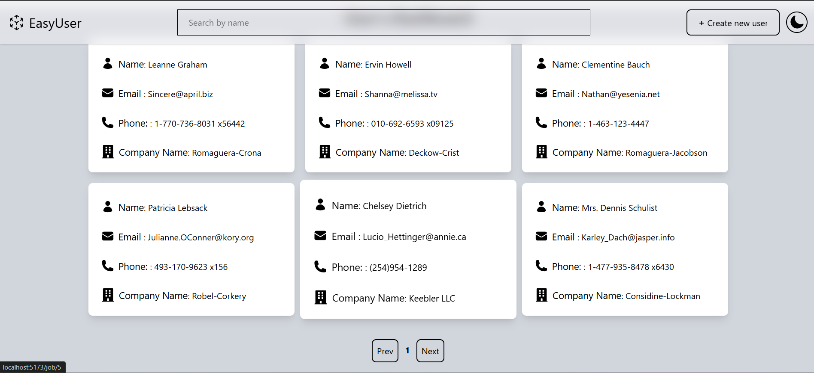
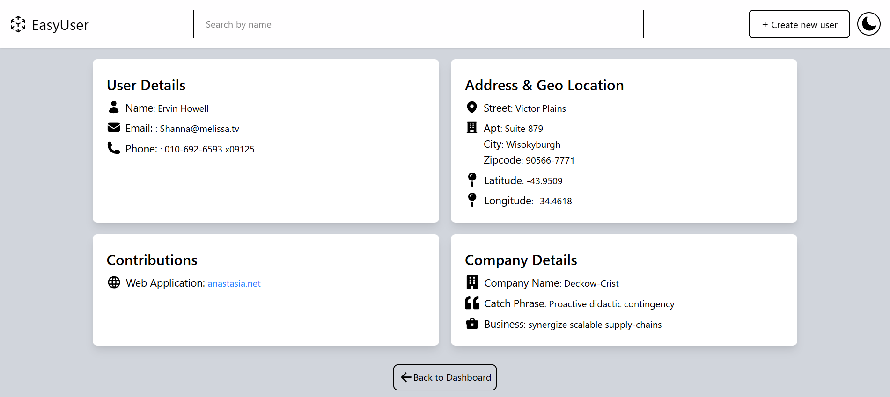
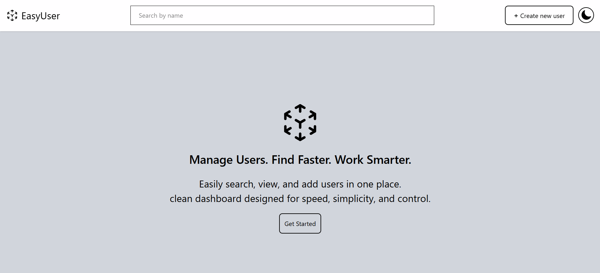
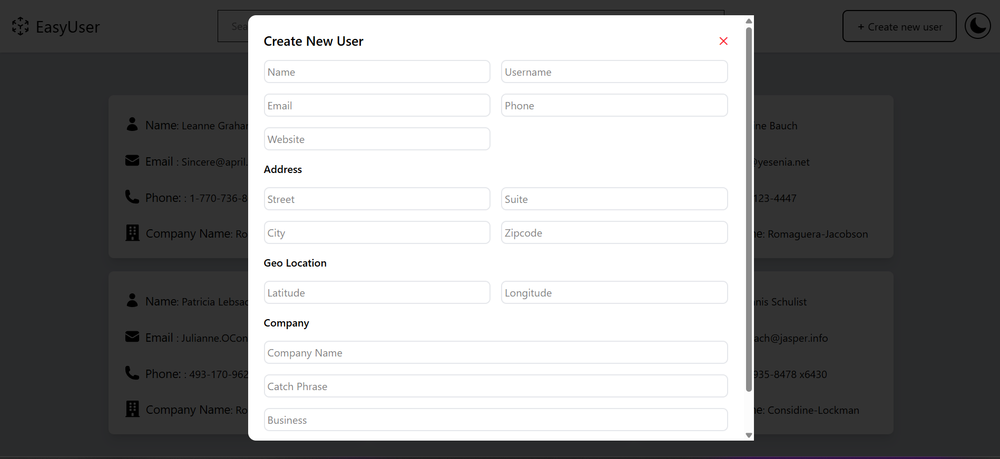

###  Mobile View
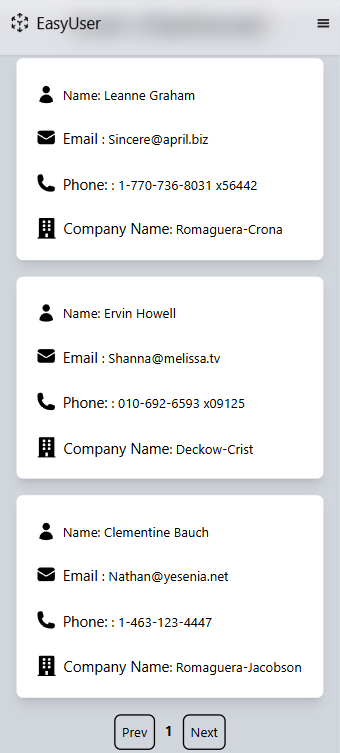
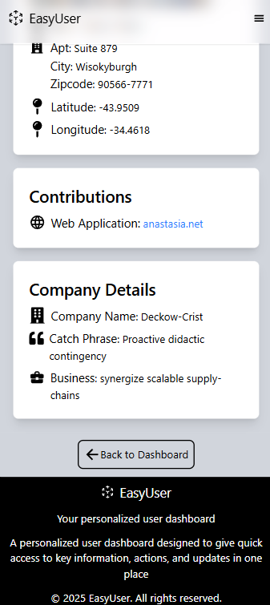
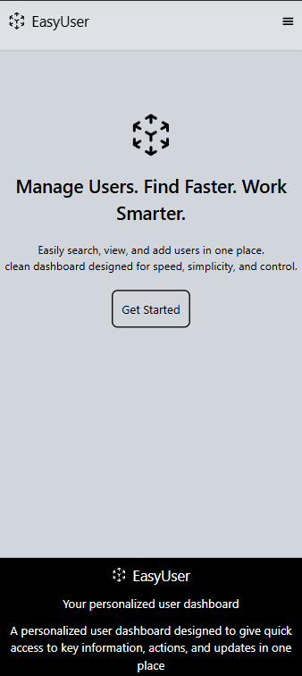
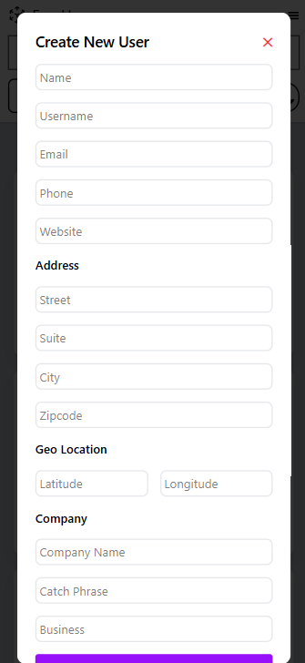

###  Dark Mode
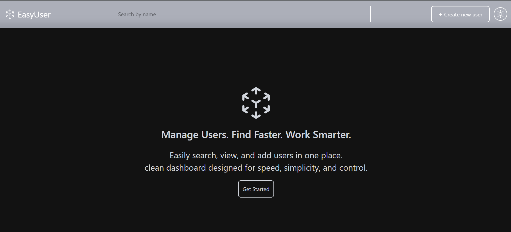


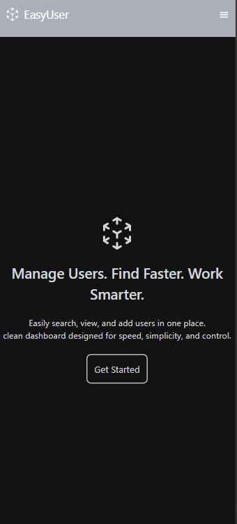
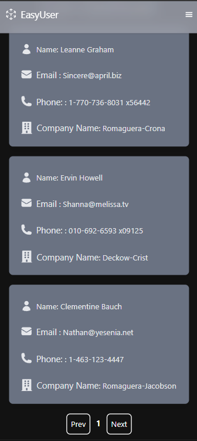
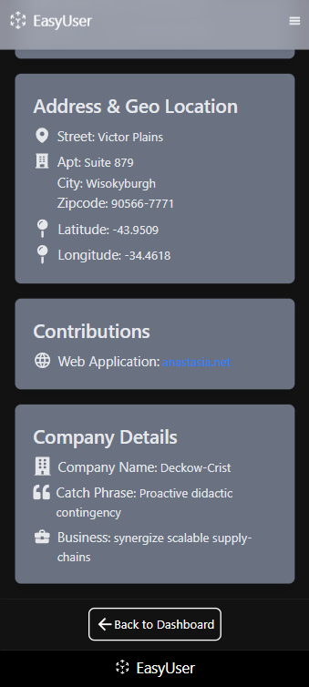

---
